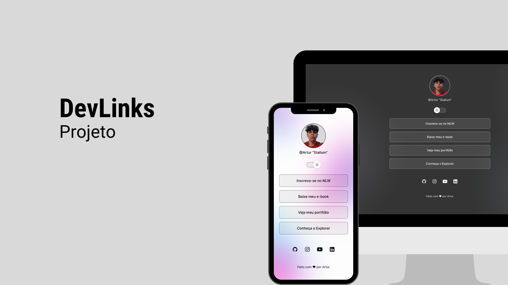

<h1 align="center"> DevLinks </h1>

 
  Uma página para depositar meus links e trabalhos  
  A page for deposit my links and projects  
  <a href="https://stallum.github.io/DevLinks/">Acesse esse site clicando aqui.</a>

  <a href="#💻-tecnologias">Tecnologias</a>&nbsp;&nbsp;&nbsp;|&nbsp;&nbsp;&nbsp;
  <a href="#🧑‍💻-projeto">Projeto</a>&nbsp;&nbsp;&nbsp;|&nbsp;&nbsp;&nbsp;
  <a href="#🎨-layout">Layout</a>

 

  

## 💻 Tecnologias
Esse projeto foi desenvolvido com as seguintes tecnologias:

- HTML e CSS
- JavaScript
- Git e Github
- Figma

## 🧑‍💻 Projeto
O DevLinks é um agregador de links para usar como cartão de visitas online.
- [Acesse o projeto finalizado, online](https://stallum.github.io/DevLinks/)

## 🎨 Layout

Você pode visualizar o layout do projeto através [DESSE LINK](https://www.figma.com/community/file/1319681157711462534/devlinks). É necessário ter conta no [Figma](https://figma.com) para acessá-lo.

---

Feito com ❤️ by Artur "Stallum" :wave: